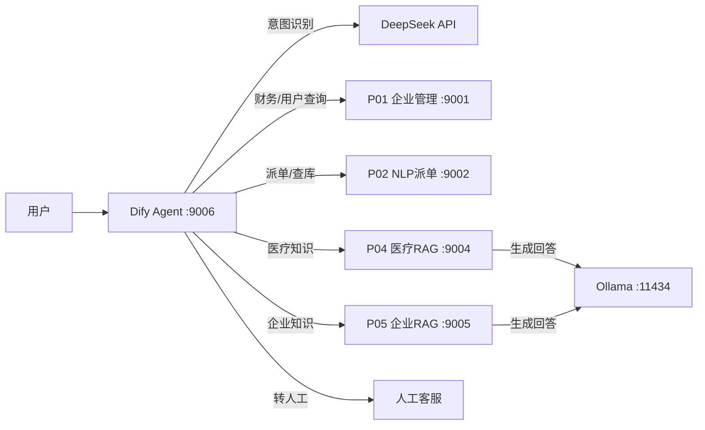

# AI 全栈生态项目 — 落地总结文档

> 六个项目从传统业务系统到 AI 智能体的完整技术闭环。本文档说清每个项目是什么、怎么用、接口怎么调。

---

## 一、项目全景

```
用户输入 "3号楼202房间电风扇坏了"
        →   Dify Agent (DeepSeek LLM)
        →意图识别: 这是报修场景
        →   项目二 智能派单 API (:9002)
        →自动创建工单
   回复用户: 工单已创建，编号#16
```

### 系统架构



---

## 二、端口总览与访问地址

> **地址列 = 浏览器打开后能看到项目页面的地址**

| 项目 | 端口 | 项目页面地址 | 技术栈 | 说明 |
|------|------|------------|--------|------|
| P01 企业管理 | 9001 | [http://localhost:5173](http://localhost:5173)（前端页面）<br>[http://localhost:9001](http://localhost:9001)（后端API） | Spring Boot + Vue + MySQL | 财务、用户、RBAC |
| P02 NLP派单 | 9002 | [http://localhost:5174](http://localhost:5174)（前端页面）<br>[http://localhost:9002](http://localhost:9002)（后端API） | Spring Boot + Vue + MySQL | 智能派单、大白话查库 |
| P03 微调模型 | — | — | Ollama + DeepSeek | 训练取消，LLM 由 Ollama/DeepSeek 替代 |
| P04 医疗RAG | 9004 | [http://localhost:9004/docs](http://localhost:9004/docs)（API文档） | FastAPI + Milvus | 医疗知识库问答 |
| P05 企业RAG | 9005 | [http://localhost:9005/docs](http://localhost:9005/docs)（API文档） | FastAPI + ES + Milvus | 企业知识库问答 |
| P06 Agent总管 | 9006 | [http://localhost:9006](http://localhost:9006)（Dify管理台）<br>[http://localhost:9006/chat/QE5z5H48rYoZMabr](http://localhost:9006/chat/QE5z5H48rYoZMabr)（Agent聊天） | Dify v1.14.2 + DeepSeek | 智能体合流总管 |
| Ollama | 11434 | [http://localhost:11434](http://localhost:11434) | qwen2.5:1.5b | 本地LLM，给P04/P05用 |

---

## 三、各项目简介与使用方法

### 项目一：企业管理基座系统

**做了什么**：传统企业管理后台，提供 RBAC 权限管理、财务报表 CRUD、AI 智能财务摘要、Excel 导入导出。前端是 Vue + Element Plus 管理后台。

**怎么启动**：
```bash
# 后端
cd 01_企业管理基座系统/backend
双击 启动系统.bat

# 前端（需要 Node.js）
cd 01_企业管理基座系统/frontend
npm install
npm run dev
```

**看效果**：
- 打开浏览器访问 **[http://localhost:5173](http://localhost:5173)** → 看到企业管理后台登录页
- 账号：`admin` / 密码：`123456`
- 后端 API 地址：[http://localhost:9001](http://localhost:9001)

**数据库**：MySQL 8.x（端口 3306），数据库名 `enterprise_db`

---

### 项目二：政企物流智能化转化

**做了什么**：让传统业务接口"听懂大白话"。核心能力：口语化自动派单（描述故障 → 自动创建工单）、自然语言查数据库（问问题 → LLM 转 SQL → 返回结果）。

**怎么启动**：
```bash
cd 02_政企物流智能化转化/backend
双击 start.bat
```

**看效果**：
- 打开浏览器访问 **[http://localhost:5174](http://localhost:5174)** → 看到物流管理前端页面
- 后端 API 地址：[http://localhost:9002](http://localhost:9002)
- 测试派单：`curl -X POST http://localhost:9002/api/nlp/dispatch -H "Content-Type: application/json" -d '{"text":"3号楼202房间电风扇坏了"}'`

**数据库**：MySQL 8.x（端口 3306），数据库名 `logistics_db`

---

### 项目三：垂直领域模型微调

**做了什么**：原计划通过 SFT 微调让模型学会"守规矩"输出标准 JSON。因本机 GPU 不足（RTX 3060 6GB），训练取消。

**当前替代方案**：
- Agent 大脑：DeepSeek deepseek-v4-flash（Dify 内置配置）
- RAG 文档生成：Ollama qwen2.5:1.5b（P04/P05 本地调用）
- 训练数据和脚本保留备用，未来有 GPU 可随时重训

---

### 项目四：医疗智能问诊基础 RAG

**做了什么**：基于 Milvus 向量检索的医疗知识库。输入疾病/症状/药物问题，从医疗文档中检索相关片段，用 LLM 生成专业回答。

**怎么启动**：
```bash
cd 04_医疗智能问诊基础RAG/backend
双击 start.bat
```

**看效果**：
- 打开浏览器访问 **[http://localhost:9004/docs](http://localhost:9004/docs)** → 看到 FastAPI 交互式 API 文档（Swagger UI）
- 可以直接在页面上测试各种接口
- 健康检查：[http://localhost:9004/api/health](http://localhost:9004/api/health)

**依赖**：Ollama（:11434）、Milvus（Docker, :19530）

---

### 项目五：企业级高级 RAG 知识库

**做了什么**：企业知识库问答，支持 ES + Milvus 混合检索 + Reranker 重排序。适用于规章制度、合同规范等企业文档的智能问答。

**怎么启动**：
```bash
cd 05_企业级高级RAG知识库
双击 start.bat
```

**看效果**：
- 打开浏览器访问 **[http://localhost:9005/docs](http://localhost:9005/docs)** → 看到 FastAPI 交互式 API 文档（Swagger UI）
- 可以直接在页面上测试知识库查询
- 健康检查：[http://localhost:9005/api/rag/health](http://localhost:9005/api/rag/health)

**依赖**：Ollama（:11434）、Elasticsearch（Docker, :9200）、Milvus（Docker, :19530）

---

### 项目六：Agent 智能体合流总管

**做了什么**：压轴大合流。通过 Dify 平台将 P01/P02/P04/P05 串联为一个智能体闭环：大白话输入 → 意图识别 → 自动调用工具 → 自然语言回答。

**怎么启动**：
```bash
cd D:\dify\docker
docker compose up -d
```

**看效果**：
- 打开浏览器访问 **[http://localhost:9006](http://localhost:9006)** → Dify 管理台
- 点击 Agent 应用 → 进入聊天 → **[http://localhost:9006/chat/QE5z5H48rYoZMabr](http://localhost:9006/chat/QE5z5H48rYoZMabr)**（直接聊天入口）
- 登录：`2257302877@qq.com` / `pty666666`
- API Key：`app-jX3smW5hgad8jxsOhqp1osyo`

---

## 四、完整接口速查表

### 项目一 (:9001) — 需要 JWT 认证

获取 Token：
```bash
curl -X POST http://localhost:9001/api/auth/login \
  -H "Content-Type: application/json" \
  -d '{"username":"admin","password":"123456"}'
```

| 方法 | URL | 功能 | 认证 |
|------|-----|------|------|
| POST | `/api/auth/login` | 登录 | 无 |
| GET | `/api/auth/info` | 当前用户信息 | JWT |
| GET | `/api/dashboard/summary` | 仪表盘汇总 | JWT |
| GET | `/api/finance/page` | 财务分页查询 | JWT |
| POST | `/api/finance/ai-summary` | AI 财务摘要 | JWT |
| POST | `/api/finance/import` | Excel 导入 | JWT |
| GET | `/api/finance/template` | 下载导入模板 | JWT |
| GET | `/api/user/page` | 用户分页搜索 | JWT |
| POST | `/api/user` | 新增用户 | JWT |
| PUT | `/api/user` | 更新用户 | JWT |
| DELETE | `/api/user/{id}` | 删除用户 | JWT |
| PUT | `/api/user/reset-password/{id}` | 重置密码 | JWT |
| GET | `/api/role/page` | 角色分页查询 | JWT |
| GET | `/api/menu/list` | 当前用户菜单 | JWT |

### 项目二 (:9002) — 无认证

| 方法 | URL | 功能 |
|------|-----|------|
| POST | `/api/nlp/dispatch` | 口语化智能派单 |
| POST | `/api/nlp/query` | 大白话查数据库 |
| GET | `/api/nlp/query/history` | 查询历史记录 |
| GET | `/api/work-order/list` | 工单分页列表 |
| GET | `/api/work-order/{id}` | 工单详情 |
| PUT | `/api/work-order/status` | 更新工单状态 |
| PUT | `/api/work-order` | 更新工单详情 |
| DELETE | `/api/work-order/{id}` | 删除工单 |

### 项目四 (:9004) — 无认证

| 方法 | URL | 功能 |
|------|-----|------|
| POST | `/api/chat` | 医疗知识库问答 |
| POST | `/api/chat/stream` | SSE 流式医疗问答 |
| POST | `/api/knowledge/upload` | 上传医疗文档 |
| GET | `/api/knowledge/list` | 列出已导入文档 |
| DELETE | `/api/knowledge/{doc_name}` | 删除文档 |
| GET | `/api/health` | 健康检查 |

### 项目五 (:9005) — 无认证

| 方法 | URL | 功能 |
|------|-----|------|
| POST | `/api/rag/query` | 企业知识库问答 |
| GET | `/api/rag/health` | 服务健康检查 |

### 项目六 Dify Agent (:9006)

| 方法 | URL | 功能 | 认证 |
|------|-----|------|------|
| POST | `/v1/chat-messages` | Agent 对话(SSE) | API Key |

---

## 五、Agent 合流演示（6 个场景）

通过 `tests/agent_demo.py` 验证的完整流程：

| # | 用户输入 | 意图识别 | 调用工具 | 回答 |
|---|---------|---------|---------|------|
| 1 | "帮我查一下3月份的财务数据" | tool_query | P01 finance_report_query | 返回财务数据 |
| 2 | "员工年假有几天？" | knowledge | P05 rag_knowledge_query | 基于规章制度回答 |
| 3 | "3号楼202房间电风扇坏了" | tool_dispatch | P02 smart_dispatch | 创建工单 #16 |
| 4 | "感冒了吃什么药？" | knowledge | P04 medical_chat | 基于医疗文档回答 |
| 5 | "我要投诉！" | human_handoff | 无 | 转人工话术 |
| 6 | "帮我查物流" → 补充单号 | tool_query(多轮) | P02 nlp_natural_query | 查库返回结果 |

---

## 六、部署与运维

### 一键启动所有服务
```bash
cd D:\Codex-project\Agent_Ultimate_System\06_Agent智能体合流总管
双击 start-all.bat
```

### 手动启动顺序

```
1. Ollama（自动随系统启动）
2. Docker 容器 (ES + Milvus): cd D:\dify\docker && docker compose up -d
3. Dify: 同上（或 cd D:\dify\docker 单独启动）
4. P01: 双击 01_企业管理基座系统\启动系统.bat
5. P01 前端: cd 01_企业管理基座系统\frontend && npm run dev
6. P02: 双击 02_政企物流智能化转化\backend\start.bat
7. P02 前端: cd 02_政企物流智能化转化\frontend && npm run dev
8. P04: 双击 04_医疗智能问诊基础RAG\backend\start.bat
9. P05: 双击 05_企业级高级RAG知识库\start.bat
```

### 常见问题

| 问题 | 解决方案 |
|------|---------|
| P01 启动报错：没有主清单属性 | 在 backend 目录执行 `mvn clean package -DskipTests` 重新编译 |
| P04 启动慢 | 首次启动需下载 embedding 模型（约 1.3GB），后续秒启 |
| Dify 登录失败 | 密码: pty666666，邮箱: 2257302877@qq.com |
| P01 工具调用返回 401 | JWT Token 过期，重新 POST `/api/auth/login` 获取 |
| Agent 回答不调工具 | 确认 Dify 中已添加工具（Web UI → Agent → 工具 → +） |
| DeepSeek 费用 | 每次对话约 ¥0.01，可在 Dify 中切换 Ollama 免费用 |
| P01/P02 前端白屏 | 检查 vite.config.js 代理端口是否为 9001/9002 |

### DeepSeek API Key

当前配置的 Key: `sk-540222586bf946bfa0e6af4b4453650b`，如需更换：
1. 登录 [https://platform.deepseek.com](https://platform.deepseek.com)
2. 设置 → 模型供应商 → DeepSeek → 更新 API Key

---

## 七、项目三备用训练方案（未来有 GPU 时）

如果未来租到 GPU 服务器（如 AutoDL RTX 4090），可以训练专属微调模型：
```bash
# 1. 上传项目到 GPU 服务器
scp -r 03_垂直领域模型微调/ root@<服务器IP>:/root/

# 2. 训练
cd /root/03_垂直领域模型微调
pip install -r requirements.txt
bash train.sh

# 3. 部署为 vLLM API
vllm serve output/checkpoint-xxx --port 9003 --api-key vertical-sft-secret-key

# 4. 在 Dify 中切换模型
# 设置 → 模型供应商 → 添加 OpenAI Compatible
# API Base: http://host.docker.internal:9003/v1
# 切换 Agent 模型到 vertical-sft-model
```

训练数据已就绪：`data/cleaned/train_final.json`（41 条）

---

*最后更新: 2026-06-11*
