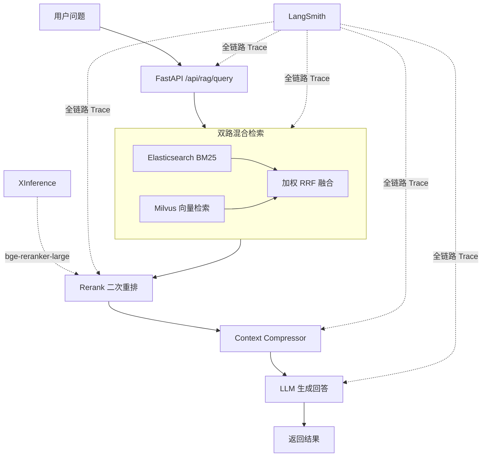
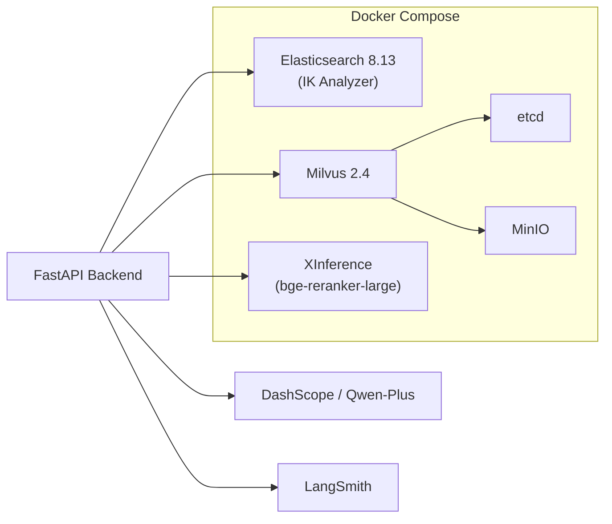
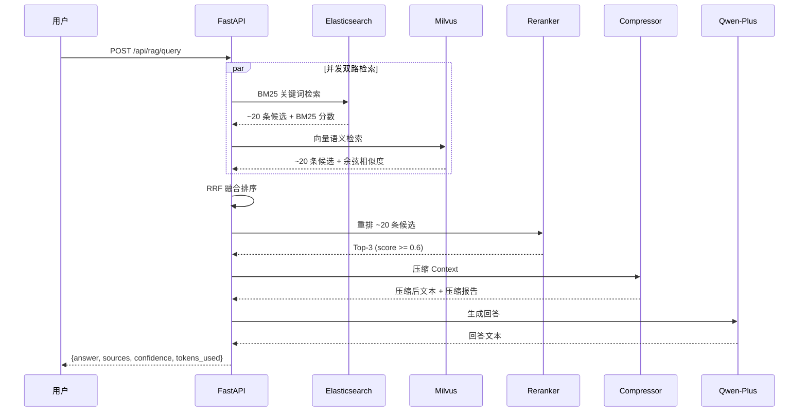

# 系统架构

## 整体架构图

```mermaid
flowchart TD
    A["用户问题"] --> B["FastAPI /api/rag/query"]
    B --> C["Hybrid Search"]

    subgraph C["双路混合检索"]
        C1["Elasticsearch BM25"]
        C2["Milvus 向量检索"]
        C1 --> C3["加权 RRF 融合"]
        C2 --> C3
    end

    C --> D["Rerank 二次重排"]
    D --> E["Context Compressor"]
    E --> F["LLM 生成回答"]
    F --> G["返回结果"]

    H["XInference"] -.->|"bge-reranker-large"| D
    I["LangSmith"] -.->|"全链路 Trace"| B
    I -.->|"全链路 Trace"| C
    I -.->|"全链路 Trace"| D
    I -.->|"全链路 Trace"| E
    I -.->|"全链路 Trace"| F
```

## 服务依赖关系

```mermaid
flowchart LR
    subgraph Docker["Docker Compose"]
        ES["Elasticsearch 8.13\n(IK Analyzer)"]
        MV["Milvus 2.4"]
        XINF["XInference\n(bge-reranker-large)"]
        ETCD["etcd"]
        MINIO["MinIO"]
    end

    API["FastAPI Backend"] --> ES
    API --> MV
    API --> XINF
    MV --> ETCD
    MV --> MINIO
    API --> LLM["DashScope / Qwen-Plus"]
    API --> LS["LangSmith"]
```

## 检索流程详细

```mermaid
sequenceDiagram
    participant U as 用户
    participant API as FastAPI
    participant ES as Elasticsearch
    participant MV as Milvus
    participant RR as Reranker
    participant CP as Compressor
    participant LLM as Qwen-Plus

    U->>API: POST /api/rag/query
    par 并发双路检索
        API->>ES: BM25 关键词检索
        ES-->>API: ~20 条候选 + BM25 分数
        API->>MV: 向量语义检索
        MV-->>API: ~20 条候选 + 余弦相似度
    end
    API->>API: RRF 融合排序
    API->>RR: 重排 ~20 条候选
    RR-->>API: Top-3 (score >= 0.6)
    API->>CP: 压缩 Context
    CP-->>API: 压缩后文本 + 压缩报告
    API->>LLM: 生成回答
    LLM-->>API: 回答文本
    API-->>U: {answer, sources, confidence, tokens_used}
```
