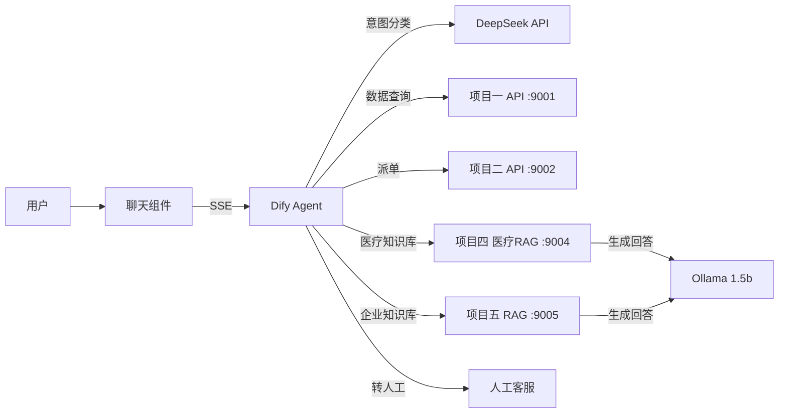

# Agent 智能体合流总管

> 第六阶段压轴项目 — 将企业管理系统、NLP派单、医疗问诊RAG、高级RAG串联为一个智能体闭环

## 核心能力

- **大白话输入** → 智能意图识别 → 自动调用工具查询/修改数据库
- **五路意图路由**：数据查询 | 企业知识库 | 医疗知识库 | 智能派单 | 人工转接
- **参数补全**：缺参数时主动追问，多轮对话自动补全
- **SSE 流式输出**：打字机效果实时展示
- **可嵌入**：一行代码嵌入任意网页

## 技术栈

| 组件 | 技术 |
|------|------|
| AI Agent 平台 | Dify v1.14.2 (开源版) |
| LLM | DeepSeek deepseek-v4-flash (Agent大脑) + Ollama qwen2.5:1.5b (RAG生成) |
| 工具调用 | OpenAPI 3.0 + Tool Calling |
| 知识库 | ES + Milvus 混合检索 + Rerank |
| 流式输出 | SSE (Server-Sent Events) |
| 前端 | HTML/CSS/JS SDK |
| 容器化 | Docker Compose |

## 前置依赖

| 项目 | 端口 | 说明 |
|------|------|------|
| 01_企业管理基座系统 | 9001 | 财务查询、用户搜索 |
| 02_政企物流智能化转化 | 9002 | NLP 派单、大白话查库 |
| 04_医疗智能问诊基础RAG | 9004 | 医疗知识库问答 |
| 05_企业级高级RAG知识库 | 9005 | 企业知识库查询 |

注: 项目三(微调模型)不再训练，LLM 由 Ollama (qwen2.5:1.5b) + DeepSeek API 替代。

## 目录结构

```
06_Agent智能体合流总管/
├── openapi/                 # OpenAPI 3.0 工具定义
│   ├── project1-tools.json  # 项目一：财务/用户工具
│   ├── project2-tools.json  # 项目二：派单/查库工具
│   ├── project4-medical-rag.json  # 项目四：医疗知识库工具
│   └── project5-rag.json    # 项目五：企业RAG知识库工具
├── prompts/
│   └── system-prompt.md     # Agent 主控 System Prompt
├── workflow/
│   └── chatflow-design.md   # Dify Chatflow 节点编排设计
├── frontend/
│   ├── chat-widget.js       # 嵌入式聊天 JS SDK
│   ├── chat-widget.css      # 样式
│   ├── index.html           # 完整演示页面
│   └── demo.html            # 最简嵌入示例
├── tests/
│   ├── e2e_test.py          # 端到端测试脚本
│   ├── agent_demo.py        # 全链路演示脚本（6场景全通过）
│   └── test-cases.json      # 测试用例定义
├── docs/
│   ├── 架构图.md      # Mermaid 架构图
│   ├── 部署文档.md           # 从零部署全流程
│   ├── 企业微信嵌入方案.md    # 企微/微信嵌入方案
│   └── 项目三接入指南.md     # P03 不再训练时的替代方案
├── scripts/
│   └── dify_setup.py        # Dify 自动化配置脚本
├── start-all.bat            # 一键启动所有前置服务
└── README.md
```

## 快速开始

### 1. 启动 Dify（如已部署可跳过）

```bash
cd D:\dify\docker
docker compose up -d
```

### 2. 启动前置服务

```bash
start-all.bat
```

### 3. 配置 Dify

1. 访问 `http://localhost:9006`
2. 设置 → 模型供应商 → 添加 DeepSeek（API Key: sk-5402...）
3. 工具 → 导入 `openapi/` 目录下的 4 个 JSON 文件
4. 创建 Agent 应用，填入 `prompts/system-prompt.md` 中的 System Prompt
5. 发布应用，获取 API Key

### 4. 测试

```bash
cd tests
python agent_demo.py
```

### 5. 前端嵌入

```html
<script src="chat-widget.js"></script>
<script>
  AgentChatWidget.init({
    apiBase: 'http://your-dify-host',
    apiKey: 'app-your-key'
  });
</script>
```

## 架构图

详见 [docs/架构图.md](docs/架构图.md)



## 测试场景

| # | 输入 | 预期 |
|---|------|------|
| 1 | "帮我查一下3月份的财务数据" | 工具路由 → 返回财务数据 |
| 2 | "员工年假有几天" | 企业知识库路由 → 基于文档回答 |
| 3 | "3号楼202房间电风扇坏了" | 派单路由 → 创建工单 |
| 4 | "感冒了吃什么药" | 医疗知识库路由 → 基于医疗文档回答 |
| 5 | "帮我查一下物流" → 追问 → 提供单号 | 参数补全多轮对话 |
| 6 | "我要投诉！" | 人工转接话术 |

## 许可证

内部项目，仅限企业使用。
