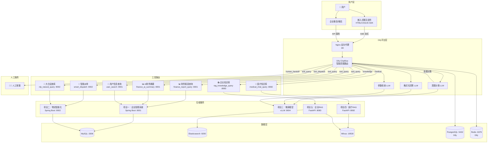
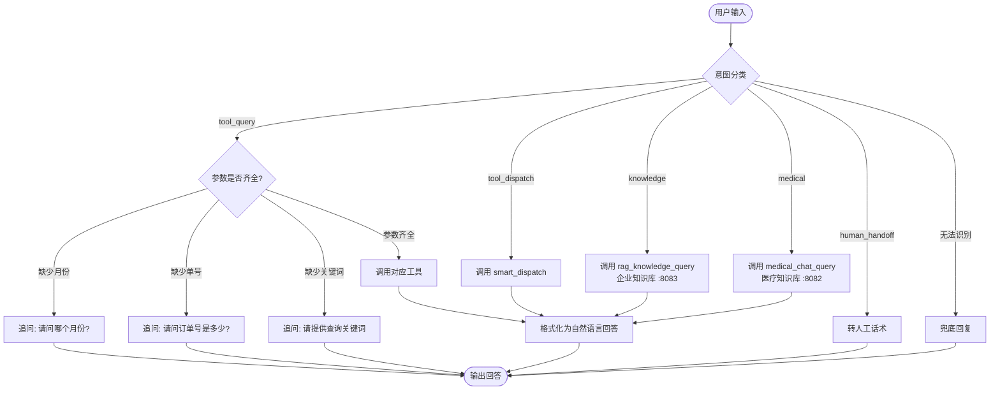
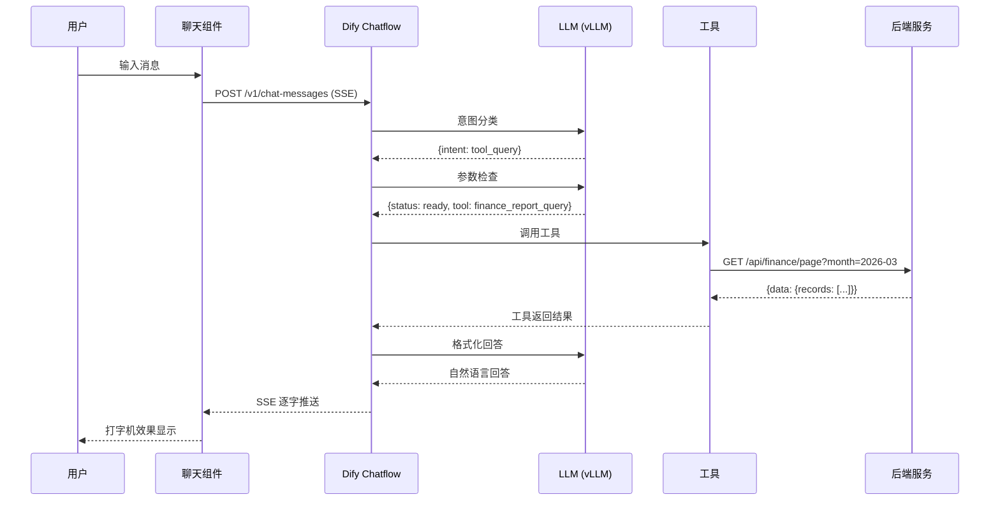

# 系统架构图

## 整体架构

## 意图路由流程

## 数据流图

## 端口规划

| 服务 | 端口 | 说明 |
|------|------|------|
| Dify Nginx | 80 | 主入口 |
| Dify API | 5001 | 内部 API |
| Dify Web | 3000 | Web 前端 |
| 项目一 | 9001 | 企业管理系统 |
| 项目二 | 9002 | 物流智能化 |
| 项目三 | 9004 | vLLM 推理 |
| 项目四 | 8082 | 医疗RAG知识库 |
| 项目五 | 8083 | 企业RAG知识库 |
| MySQL | 3306 | 项目一二共用 |
| PostgreSQL | 5432 | Dify 数据库 |
| Redis | 6379 | Dify 缓存 |
| Elasticsearch | 9200 | BM25 检索 |
| Milvus | 19530 | 向量检索 |
